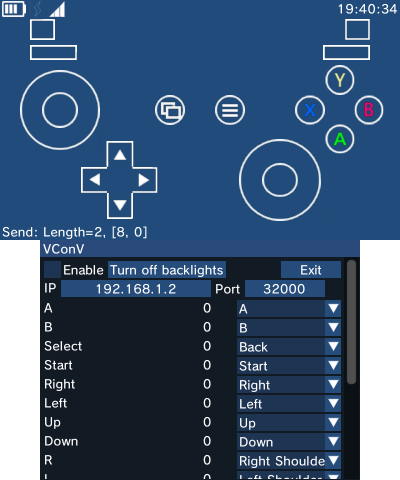

# VConV
Virtual Controller for VConV.

This app can make use of 3DS to simulate Xbox controller on Windows.

## Usage
* On Windows: [Download](https://github.com/lxfly2000/VConV/releases) and run `vconvwin(64).exe`, configure listening port of virtual controllers, click “Enable/Disable”.
* On 3DS: [Download](https://github.com/lxfly2000/VConV/releases) and run `vconv3ds.3dsx` from Homebrew menu, configure IP:Port of host on which you run exe, click “Enable”.

## Screenshot

